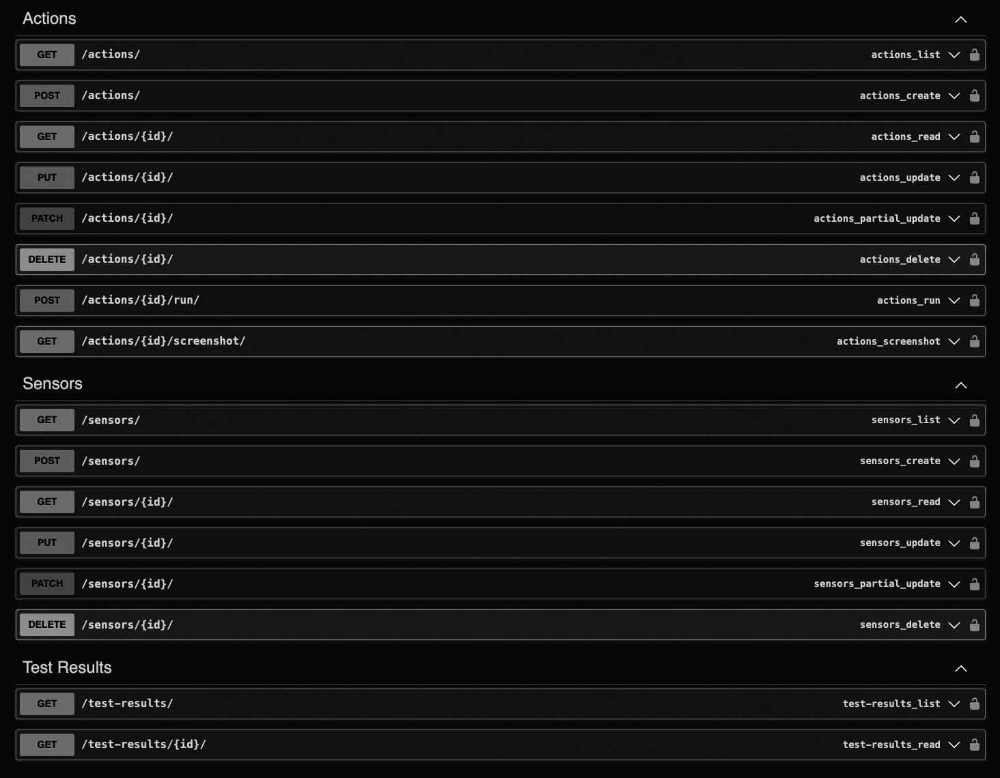

# Djanguard

This project is a web-based monitoring platform using Django for the backend and JavaScript for the frontend. It helps users manage sensors and actions, automating endpoint checks.

## Key Features:

- Sensor Monitoring: Add and manage sensors with URLs and monitoring frequencies.
- Action Management: Automate endpoint checks and validate responses.
- Assertions and Testing: Supports status code checks, keyword searches, JSON verification, and Playwright scripts.
- Automated Commands: Uses a CommandHandler class to execute Selenium-like commands (e.g., element checks, clicks) for automated actions.
- Integrated Backend and Frontend: Django backend with JavaScript frontend for seamless interaction.
- User-Friendly Interface: Intuitive forms and clear feedback.

## Technical Stack:

- Backend: Django, Django REST Framework.
- Frontend: JavaScript.
- Libraries: Playwright for browser automation, BeautifulSoup for HTML parsing, and PIL for image processing.

## RESTful API

The project provides a RESTful API documented using Swagger. The API supports CRUD operations for **Action**, **Sensor**, and **TestResult**, and includes additional endpoints for running actions and taking screenshots. It uses JSON for data interchange and offers two security methods: API Key (via Bearer token) and Basic Authentication.

## Playwright

[Playwright](https://playwright.dev/python/) is used for browser automation to simulate real user interactions, such as clicking, form filling, and verifying content on pages. This allows for advanced testing scenarios and ensures that monitored endpoints behave as expected in real-world conditions.



### DSLExecutor Class:

The DSLExecutor class is responsible for executing custom scripts written in a domain-specific language (DSL) to automate browser interactions. It works with Playwright to perform actions such as clicking elements, filling forms, asserting conditions, handling page navigation, dragging and dropping elements, setting window sizes, and checking for the presence of text or elements. Examples of commands include:

- ```click "selector"```: Clicks on an element specified by the selector.
- ```fill "selector" with "value"```: Fills an input field identified by the selector with the provided value.
- ```assert element present "selector"```: Asserts that an element matching the selector is present on the page.
- ```drag and drop "source" to "target"```: Drags an element from a source to a target location.
- ```set window size "width" "height"```: Sets the browser window to a specific width and height.

This flexible scripting allows users to define complex automated workflows for testing and monitoring purposes in a simplified, human-readable format.

# Docker
Django and Celery are based on a common image you can build with:

```docker build -f Dockerfile.base -t plog/djanguard_base:0.1 .```

# Model 

# Django cheat sheet
```
python manage.py makemigrations djanguard 
python manage.py migrate
python manage.py createsuperuser
python manage.py runserver
python manage.py makemessages -l fr
python manage.py makemessages -l en
```

## Environments
```
ENVIRONMENT=development
DEBUG=True
ADMIN_URL=..............
LETSENCRYPT_HOST=.......
LETSENCRYPT_EMAIL=......
SECRET_KEY=.............
GOOGLE_MAP_API=.........
CELERY_BROKER_URL='redis://djanguard_redis:6379/1'
DB_NAME=djanguard
DB_USER=djanguard
DB_PASSWORD=............
DB_HOST=djanguard_postgresql

DB_EXTERNAL_PORT=5534
```

## Testing background processes

python manage.py shell -c "from processing.tasks import process_sessions; process_sessions()"
